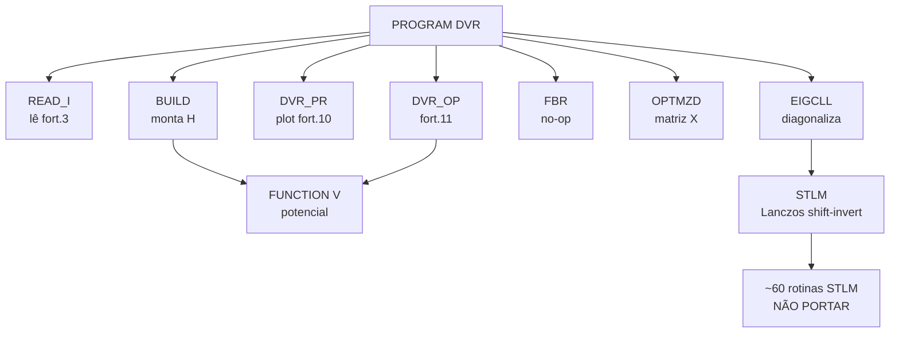

# Wiki DVR — Porte Fortran → Python

Referência completa do programa [DVR.f](../DVR.f) (Fortran 77, 6854 linhas, J.J. Soares Neto, 1995) para o porte em Python. Solver sinc-DVR da equação de Schrödinger vibracional 1D de molécula diatômica, método de Colbert & Miller, *J. Chem. Phys.* **96**, 1982 (1992).

> [!abstract] Regra de ouro do porte
> Núcleo físico ≈ 500 linhas → portar. Biblioteca STLM ≈ 6300 linhas → **NÃO portar**, substituir por `scipy.linalg.eigh`.

## Mapa do programa

- [[Pipeline Principal]] — `PROGRAM DVR`, fluxo de execução completo
- [[BUILD - Hamiltoniano]] — matriz H sinc-DVR, fórmulas de Colbert-Miller
- [[Funcao V - Potencial]] — Rydberg estendido + termo centrífugo, `Constantes2.txt`
- [[EIGCLL - Diagonalizacao]] — wrapper STLM, energias, constantes espectroscópicas
- [[Biblioteca STLM]] — Lanczos shift-invert, ~60 rotinas, substituir por SciPy
- [[Rotinas Secundarias]] — READ_I, DVR_PR, FBR, OPTMZD, DVR_OP, EXCHG
- [[Mapa de IO]] — todos os arquivos `fort.N`
- [[Unidades e Constantes]] — conversões hartree↔cm⁻¹, amu↔mₑ
- [[Bugs Legados]] — defeitos encontrados no código original
- [[Plano de Porte Python]] — estratégia, verificação, valores de regressão

## Árvore de chamadas (núcleo)

## Grafo de conhecimento (graphify)

- [[grafo/index|Vault do grafo]] — 76 notas geradas, uma por nó/comunidade + `graph.canvas`
- `graphify-out/graph.html` — visualização interativa (abrir no navegador)
- `graphify-out/GRAPH_REPORT.md` — relatório de auditoria (god nodes, comunidades, conexões)
- `graphify-out/graph.json` — dados brutos p/ consultas `/graphify query "..."`

## Status

- [x] Análise minuciosa do Fortran
- [x] Grafo de conhecimento (graphify) em `graphify-out/`
- [ ] Recuperar `Constantes2.txt` (arquivo INCLUDE ausente — bloqueia porte de V)
- [ ] Implementar porte Python
- [ ] Validar contra `fort.4` / `fort.97`
